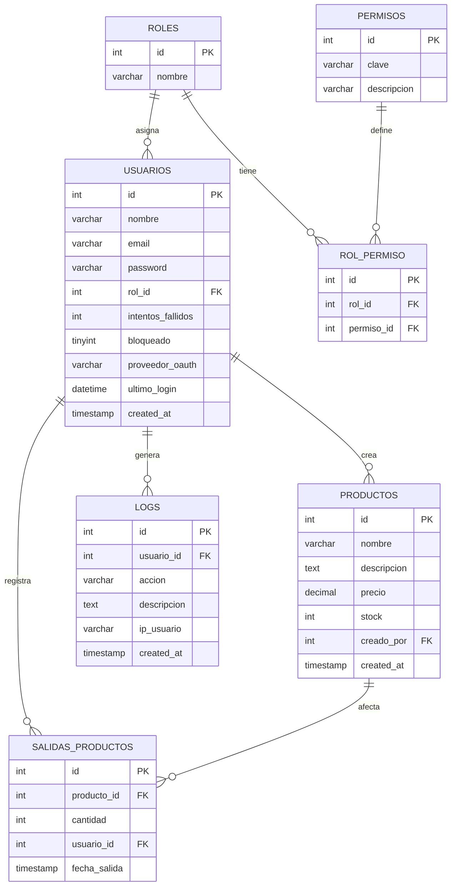

# Diagrama Entidad-Relación (DER)

```mermaid
erDiagram
    ROLES ||--o{ USUARIOS : "asigna"
    ROLES ||--o{ ROL_PERMISO : "tiene"
    PERMISOS ||--o{ ROL_PERMISO : "define"
    USUARIOS ||--o{ PRODUCTOS : "crea"
    USUARIOS ||--o{ SALIDAS_PRODUCTOS : "registra"
    PRODUCTOS ||--o{ SALIDAS_PRODUCTOS : "afecta"
    USUARIOS ||--o{ LOGS : "genera"

    ROLES {
        int id PK
        varchar nombre
    }

    USUARIOS {
        int id PK
        varchar nombre
        varchar email
        varchar password
        int rol_id FK
        int intentos_fallidos
        tinyint bloqueado
        varchar proveedor_oauth
        datetime ultimo_login
        timestamp created_at
    }

    PERMISOS {
        int id PK
        varchar clave
        varchar descripcion
    }

    ROL_PERMISO {
        int id PK
        int rol_id FK
        int permiso_id FK
    }

    PRODUCTOS {
        int id PK
        varchar nombre
        text descripcion
        decimal precio
        int stock
        int creado_por FK
        timestamp created_at
    }

    SALIDAS_PRODUCTOS {
        int id PK
        int producto_id FK
        int cantidad
        int usuario_id FK
        timestamp fecha_salida
    }

    LOGS {
        int id PK
        int usuario_id FK
        varchar accion
        text descripcion
        varchar ip_usuario
        timestamp created_at
    }
```
